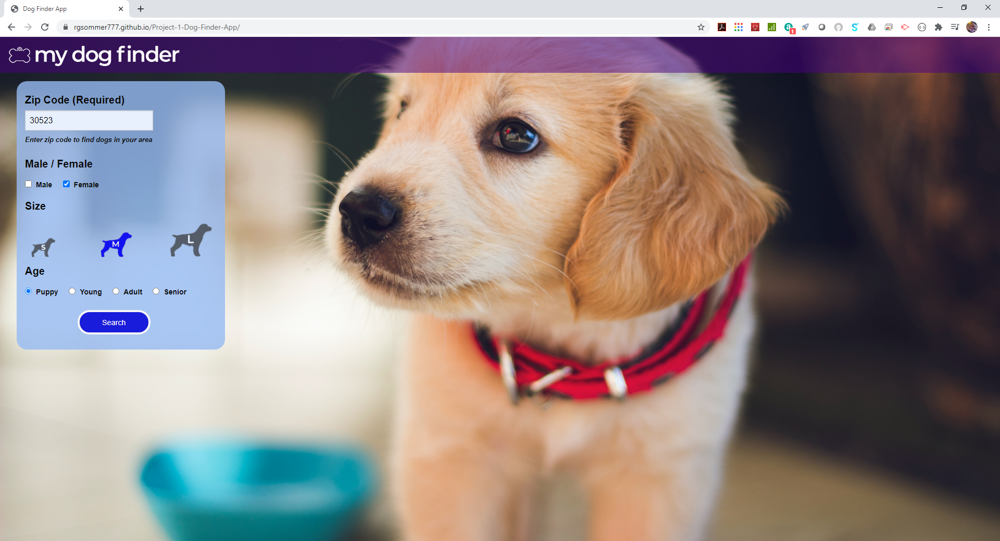
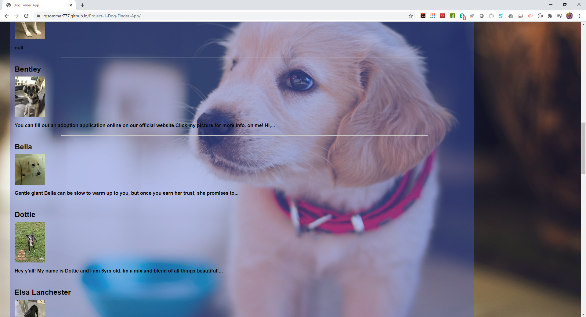
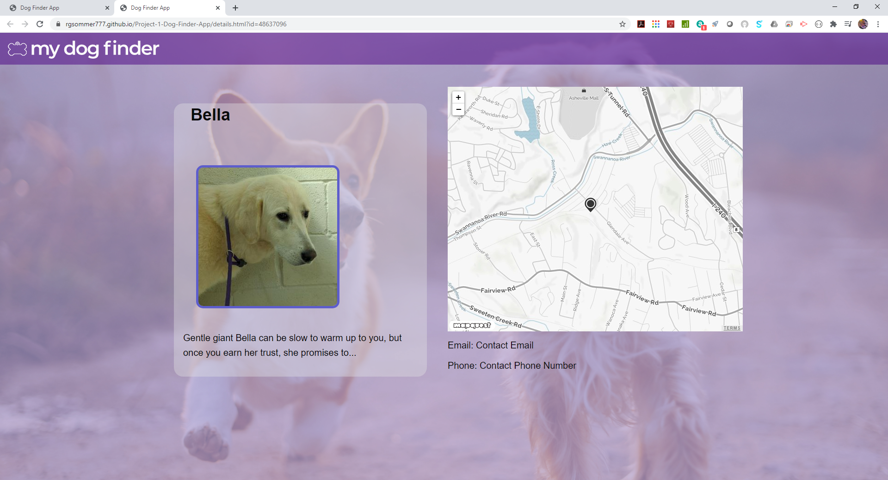
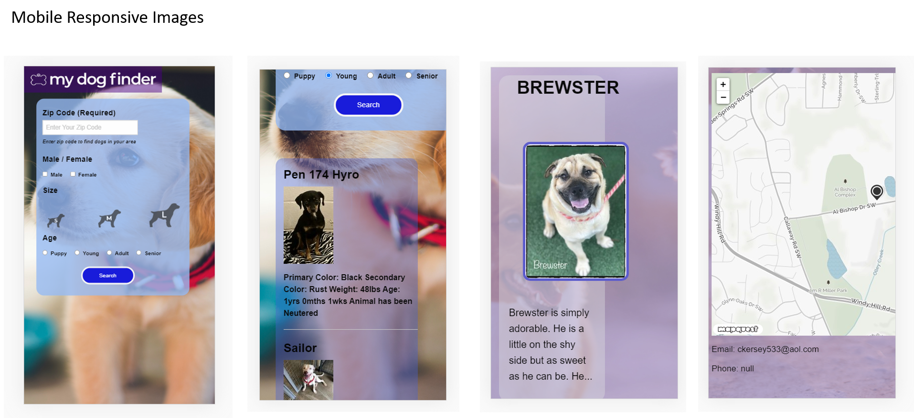

# Project 1: My Dog Finder

An interactive application designed to allow users to search for adoptable dogs in their area. User enters their zip code and other selection parameters such as size, gender and age and a list of dogs is returned for browsing. When the user selects a particular dog, they are taken to a detail page with more information on that dog and presented with a map of the shelter location.

## User Story
**AS A**  potential dog owner
**I WANT** to be able to browse local shelters for dogs in my area
**SO THAT** I can see pictures of dog with a map showing me the shelter   location

## Acceptance Criteria
**GIVEN** I’m on the landing page
**WHEN** I enter my zip code
**THEN** I see a list of dogs nearby that I can select in order to view details and location

**GIVEN** I want to select a particular dog from the list to get more details
**WHEN** I click on a particular dog, I am taken to the detail page
**THEN** I see a larger picture of the dog I selected, along with specific details about that dog and a map showing the shelter where it is located

## Approach
We chose two specific API's to call and integrate for the project: 
Petfinder.com (https://www.petfinder.com/developers/) and mapquest.com (https://developer.mapquest.com/) 
For the front end framework, we chose Foundation 6 by Zurb. 
The approach is to use the landing page (index.html) to enter the search criteria including: 
1. Zip Code 
2. Dog Gender (M/F) 
3. Dog Size (S/M/L) 
4. Dog Age (baby,young,adult,senior) 
 
When the Search button is selected, the initial API call to petfinder.com is fired which is filtered by the criteria above. The initial list of dogs (20) is returned on the same page. 
When an individual dog is selected from the list by clicking the dog name, the individual pet id is passed in the page transition to the next page (details.html)page and the petfinder API call is fired again, along with an API call to mapquest.com. 
The mapquest call uses the parsed address info from the petfinder call to pinpoint the shelter address, allowing the map image to be pulled back from mapquest and displayed alongside the dog detail and shelter contact info. 

## Screenshots

 

## Links
Git Hub Repository: https://github.com/rgsommer777/Project-1-Dog-Finder-App  
Git Hub Page: https://rgsommer777.github.io/Project-1-Dog-Finder-App/
